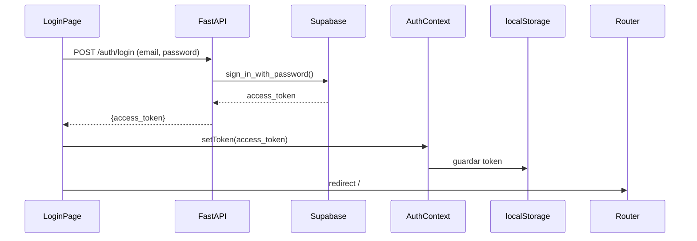

# ImageLink - Interfaz Principal

## TDD Progress

- [ ] Step 1: Clarify use cases
- [ ] Step 2: Convert use cases into test cases
- [ ] Step 3: Write failing tests first (RED)
- [ ] Step 4: Implement minimum code (GREEN)
- [ ] Step 5: Safe refactor if applicable (REFACTOR)
- [ ] Step 6: Verify and report results

---

## Decisiones clave

- **Estilos:** Tailwind CSS (se instala en el frontend)
- **Acceso a datos:** FastAPI como intermediario entre el frontend y Supabase
- **Auth:** FastAPI llama a Supabase Auth con email/password y retorna el JWT al frontend
- **Schema BD:** `"imageLINK"` (con comillas porque PostgreSQL distingue mayúsculas)

---

## Step 1: Casos de Uso

### UC-AUTH-1: Login con credenciales válidas
- **Given:** usuario no autenticado en `/login`
- **When:** ingresa email y password correctos y hace submit
- **Then:** recibe `access_token`, se guarda en `AuthContext` y `localStorage`, redirige a `/`

### UC-AUTH-2: Login con credenciales inválidas
- **Given:** usuario no autenticado en `/login`
- **When:** ingresa email o password incorrectos y hace submit
- **Then:** muestra mensaje de error; permanece en `/login`

### UC-AUTH-3: Acceso no autenticado a ruta protegida
- **Given:** no hay token en `localStorage`
- **When:** navega directamente a `/`
- **Then:** redirige automáticamente a `/login`

### UC-AUTH-4: Cerrar sesión
- **Given:** usuario autenticado
- **When:** hace click en logout
- **Then:** token eliminado de `localStorage`, redirige a `/login`

### UC-PROJ-LIST-1: Ver proyectos existentes
- **Given:** usuario autenticado con proyectos creados
- **When:** visita `/`
- **Then:** se muestra un grid de tarjetas con nombre y descripción de cada proyecto

### UC-PROJ-LIST-2: Estado vacío sin proyectos
- **Given:** usuario autenticado sin proyectos
- **When:** visita `/`
- **Then:** muestra mensaje "No tienes proyectos" con botón "Crear proyecto"

### UC-PROJ-CREATE-1: Crear proyecto con nombre válido
- **Given:** usuario autenticado en `/`
- **When:** hace click en "Nuevo proyecto", completa el nombre y confirma
- **Then:** el nuevo proyecto aparece en el grid sin recargar la página

### UC-PROJ-CREATE-2: Crear proyecto sin nombre
- **Given:** usuario autenticado, modal de creación abierto
- **When:** intenta confirmar sin nombre
- **Then:** muestra error de validación; no se llama al backend

### UC-PROJ-EDIT-1: Editar proyecto propio
- **Given:** usuario autenticado con proyectos en `/`
- **When:** hace click en editar de una tarjeta, modifica nombre/descripción y confirma
- **Then:** la tarjeta refleja los nuevos datos sin recargar

### UC-PROJ-EDIT-2: Editar proyecto ajeno (seguridad)
- **Given:** usuario autenticado
- **When:** llama `PATCH /projects/{id}` con un `id` que no le pertenece
- **Then:** FastAPI retorna `403`; el proyecto no se modifica (RLS lo bloquea)

---

## Step 2: Test Cases

### Backend — `backend/tests/test_auth.py`

| Use Case | Test Name | Tipo |
|---|---|---|
| UC-AUTH-1 | `test_login_returns_access_token` | happy path |
| UC-AUTH-2 | `test_login_invalid_credentials_returns_401` | error |
| UC-AUTH-3 | `test_me_without_token_returns_401` | error |
| UC-AUTH-4 | n/a (logout es client-side) | — |

### Backend — `backend/tests/test_projects.py`

| Use Case | Test Name | Tipo |
|---|---|---|
| UC-PROJ-LIST-1 | `test_list_projects_returns_user_projects` | happy path |
| UC-PROJ-CREATE-1 | `test_create_project_returns_created_project` | happy path |
| UC-PROJ-CREATE-2 | `test_create_project_missing_name_returns_422` | edge case |
| UC-PROJ-EDIT-1 | `test_update_project_returns_updated_data` | happy path |
| UC-PROJ-EDIT-2 | `test_update_project_not_owned_returns_403` | seguridad |

### Frontend — `frontend/src/pages/LoginPage.test.tsx`

| Use Case | Test Name | Tipo |
|---|---|---|
| UC-AUTH-1 | `renders login form and redirects on success` | happy path |
| UC-AUTH-2 | `shows error message on invalid credentials` | error |

### Frontend — `frontend/src/components/ProtectedRoute.test.tsx`

| Use Case | Test Name | Tipo |
|---|---|---|
| UC-AUTH-3 | `redirects unauthenticated user to /login` | edge case |

### Frontend — `frontend/src/pages/HomePage.test.tsx`

| Use Case | Test Name | Tipo |
|---|---|---|
| UC-PROJ-LIST-1 | `renders project cards when projects exist` | happy path |
| UC-PROJ-LIST-2 | `shows empty state when no projects` | edge case |

### Frontend — `frontend/src/components/ProjectModal.test.tsx`

| Use Case | Test Name | Tipo |
|---|---|---|
| UC-PROJ-CREATE-1 | `calls onSave with project name on submit` | happy path |
| UC-PROJ-CREATE-2 | `shows validation error when name is empty` | error |
| UC-PROJ-EDIT-1 | `pre-fills form with project data in edit mode` | happy path |

---

## Step 3-4: Implementación (después de RED)

### Cambio de schema en la BD

Modificar [`supabase/migrations/20260409050130_initial_schema.sql`](supabase/migrations/20260409050130_initial_schema.sql): reemplazar `public.` por `"imageLINK".` en **todas las referencias**.

Actualizar [`supabase/config.toml`](supabase/config.toml):

```toml
[api]
schemas = ["imageLINK", "graphql_public"]
extra_search_path = ["imageLINK", "extensions"]
```

Aplicar con `supabase db reset`.

### Backend - FastAPI

**Nuevas dependencias:** `supabase`, `python-dotenv`

```
backend/backend/
├── main.py             # CORS + routers
├── config.py           # Supabase URL/keys via env vars
├── auth/
│   ├── router.py       # POST /auth/login, GET /auth/me
│   └── deps.py         # Verifica JWT → retorna uid
└── projects/
    ├── router.py       # GET/POST /projects, PATCH/DELETE /projects/{id}
    └── schemas.py      # ProjectCreate, ProjectUpdate, ProjectOut
```

**Patrón de autorización:** JWT en `Authorization: Bearer <token>`, validado con Supabase, pasado a queries (RLS activo).

### Frontend - React + Vite + Tailwind

**Nuevas dependencias:** `react-router-dom`, `tailwindcss`, `@tailwindcss/vite`

```
src/
├── context/AuthContext.tsx
├── services/
│   ├── auth.ts
│   └── projects.ts
├── pages/
│   ├── LoginPage.tsx
│   └── HomePage.tsx
├── components/
│   ├── ProtectedRoute.tsx
│   ├── ProjectCard.tsx
│   └── ProjectModal.tsx
└── App.tsx
```

**Flujo de auth:**



### Variables de entorno

- **Backend** (`.env`): `SUPABASE_URL`, `SUPABASE_SERVICE_ROLE_KEY`, `SUPABASE_ANON_KEY`
- **Frontend** (`.env.local`): `VITE_API_URL=http://localhost:8000`
