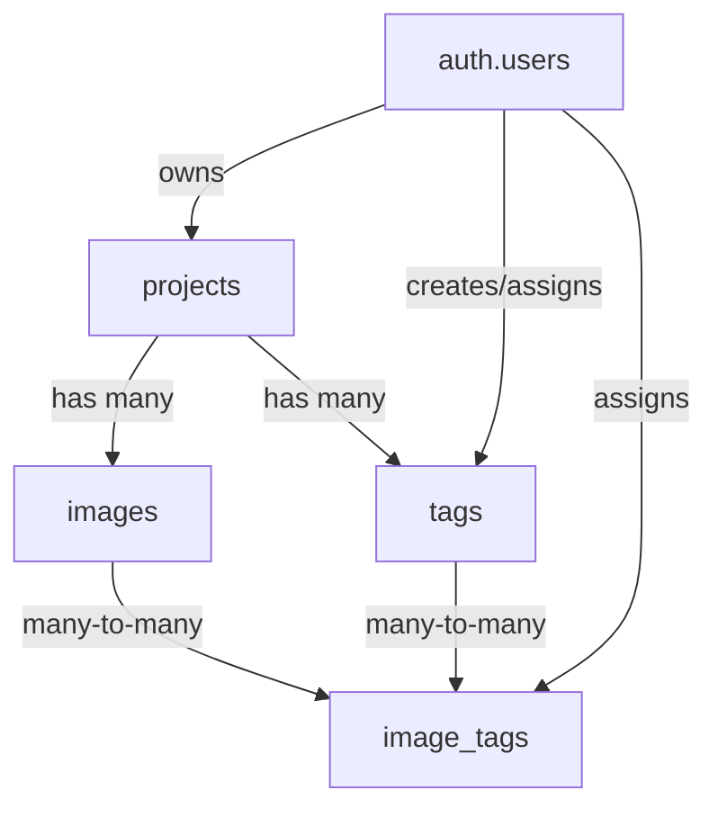

# Esquema BD inicial para ImageLink

## Alcance confirmado
- Etiquetas **por proyecto** (no globales).
- Modelo de usuario **propietario simple** (un dueño por proyecto, sin roles de colaboración).
- Base actual vacía: sin tablas ni migraciones.

## Casos de uso a cubrir
- Crear un proyecto para cargar y modificar imágenes.
- Registrar imágenes dentro de un proyecto.
- Definir etiquetas predefinidas de un proyecto.
- Asignar etiquetas a imágenes de ese proyecto.
- Modificar etiquetas ya asignadas a imágenes (reemplazar, agregar o quitar).

## Diseño de esquema propuesto
- `projects`
  - `id` (uuid, pk)
  - `owner_id` (uuid, fk -> `auth.users.id`)
  - `name` (text, not null)
  - `description` (text, null)
  - `created_at`, `updated_at` (timestamptz)
- `images`
  - `id` (uuid, pk)
  - `project_id` (uuid, fk -> `projects.id`, on delete cascade)
  - `storage_path` (text, not null)
  - `original_filename` (text, not null)
  - `status` (text/check: `uploaded|processing|ready|failed`)
  - `created_at`, `updated_at` (timestamptz)
- `tags`
  - `id` (uuid, pk)
  - `project_id` (uuid, fk -> `projects.id`, on delete cascade)
  - `name` (text, not null)
  - `normalized_name` (text, not null)
  - `created_by` (uuid, fk -> `auth.users.id`)
  - `created_at`, `updated_at` (timestamptz)
  - `unique(project_id, normalized_name)` para evitar duplicados tipo `Perro` vs `perro`.
- `image_tags` (tabla pivote)
  - `id` (uuid, pk)
  - `image_id` (uuid, fk -> `images.id`, on delete cascade)
  - `tag_id` (uuid, fk -> `tags.id`, on delete cascade)
  - `assigned_by` (uuid, fk -> `auth.users.id`)
  - `created_at` (timestamptz)
  - `unique(image_id, tag_id)` para evitar reasignación duplicada.

## Reglas de integridad y seguridad
- Índices en FKs: `projects.owner_id`, `images.project_id`, `tags.project_id`, `image_tags.image_id`, `image_tags.tag_id`.
- Trigger `updated_at` para `projects`, `images`, `tags`.
- Validar que `image_tags.tag_id` y `image_tags.image_id` pertenezcan al mismo `project_id` (con trigger de integridad cruzada).
- Activar RLS en tablas de dominio (`projects`, `images`, `tags`, `image_tags`) con política: solo el `owner_id` del proyecto puede leer/escribir sus datos.

## Flujo técnico (migraciones)
1. Crear migración SQL en [supabase/migrations/](supabase/migrations/) con tablas, índices, constraints, trigger `updated_at` y políticas RLS.
2. (Opcional) agregar datos mínimos en [supabase/seed.sql](supabase/seed.sql) para pruebas locales de etiquetas e imágenes.
3. Aplicar migración con `supabase migration up`.
4. Verificar estructura con `list_tables` y consultas `SELECT` de validación.

## Verificación (TDD pragmático para BD)
- RED: consultas de prueba que deben fallar si falta integridad (ej. insertar etiqueta duplicada por proyecto, o asignar etiqueta de otro proyecto a una imagen).
- GREEN: confirmar que constraints/triggers bloquean esos casos y permiten casos válidos.
- Validar RLS con pruebas de acceso por propietario/no propietario (si ya existe flujo de auth local para test).

## Diagrama (alto nivel)

## Archivos principales a tocar
- [supabase/migrations/](supabase/migrations/)
- [supabase/seed.sql](supabase/seed.sql)
- [supabase/config.toml](supabase/config.toml) (solo verificación, sin cambios esperados)
